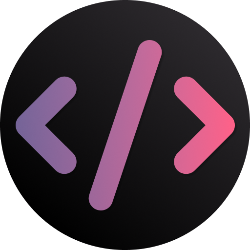
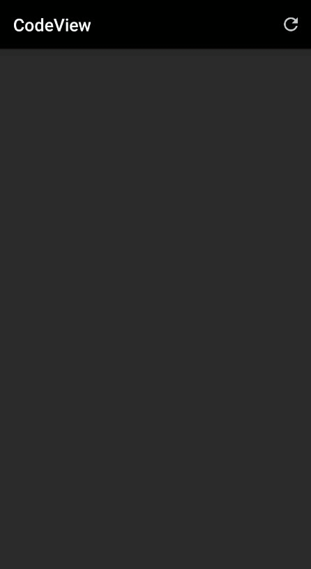
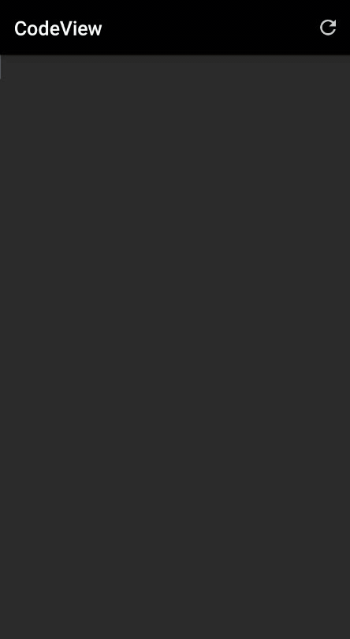
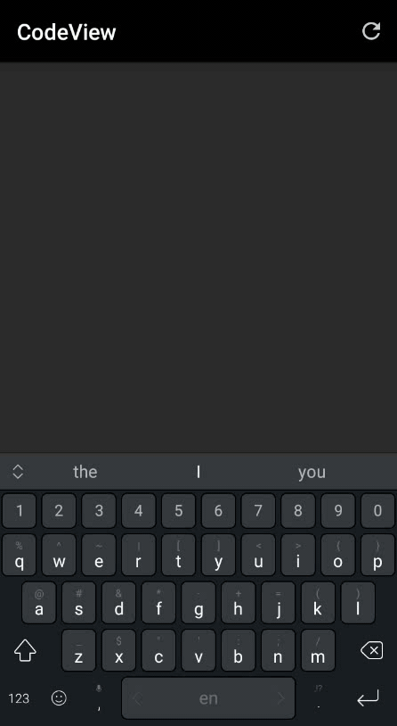

# CodeView
<p align="center">
  
</p>

[](https://app.codacy.com/gh/AmrDeveloper/CodeView?utm_source=github.com&utm_medium=referral&utm_content=AmrDeveloper/CodeView&utm_campaign=Badge_Grade_Settings)
[](https://www.codefactor.io/repository/github/amrdeveloper/codeview)

[]()

[](https://jitpack.io/#AmrDeveloper/CodeView)
[](https://android-arsenal.com/details/1/8179)

Android Library to make it easy to create your CodeEditor or IDE for any programming language 
even for your programming language, just config the view with your language keywords and other attributes
and you can change the CodeView theme in the runtime so it's made it easy to support any number of themes, 
and CodeView has AutoComplete and you can customize it with different keywords and tokenizers.

## Demo
<p align="center">
  
  
  
</p>

- Main Features
  - Can support any programming language you want.
  - Can support AutoComplete and customize it with different tokenizers and design.
  - Can support any theme you want and change it in the runtime.
  - Syntax Highlighter depend on your patterns so you can support any features like TODO comment.
  - Can support errors and warns with different colors and remove them in the runtime.
  - Can change highlighter update delay time.
  - Support Code snippets and change it in the runtime.
  - Support optional Line Number with customization.
  - Support optional highlighting current line number.
  - Support optional relative line number inspired from vim editor.
  - Support Auto indentation with customization.
  - Support highlighting matching tokens.
  - Support replace first and replace all matching tokens.
  - Support auto pair complete.

- Documentations:
  - [Full Documentation](https://amrdeveloper.github.io/CodeView/)
  - [Install Documentation](docs/install.md)
  - [Add to XML Documentation](docs/add-to-xml.md)
  - [Highlight Documentation](docs/highlight.md)
  - [Auto Complete Documentation](docs/auto-complete.md)
  - [Pair Complete Documentation](docs/pair-complete.md)
  - [Snippets Documentation](docs/snippets.md)
  - [Auto Indenting Documentation](docs/auto-indenting.md)
  - [Find and Replace Documentation](docs/find-and-replace.md)
  - [Line Number Documentation](docs/line-number.md)

- Articles
  - [Android CodeView an Easy way to create Code Editor app](https://itnext.io/android-codeview-an-easy-way-to-create-code-editor-app-5d67c3534f84)
  - [Android CodeView the easiest way to highlight text](https://itnext.io/android-codeview-the-easiest-way-to-highlight-patterns-53702e0e2164)
  - [Android CodeView Highlight search result in List Items](https://itnext.io/android-codeview-highlight-search-result-in-list-items-b7e4c9fb57d8)
  - [Android CodeView Create a code editor with Snippets](https://itnext.io/android-codeview-create-a-code-editor-with-snippets-6733094161e4)
  - [Android CodeView Auto Indentation, Find and replace](https://itnext.io/android-codeview-auto-indentation-find-and-replace-3bc91994e214)

### License

```
Copyright (c) 2020 - Present Amr Hesham

Permission is hereby granted, free of charge, to any person obtaining a copy
of this software and associated documentation files (the "Software"), to deal
in the Software without restriction, including without limitation the rights
to use, copy, modify, merge, publish, distribute, sublicense, and/or sell
copies of the Software, and to permit persons to whom the Software is
furnished to do so, subject to the following conditions:

The above copyright notice and this permission notice shall be included in all
copies or substantial portions of the Software.

THE SOFTWARE IS PROVIDED "AS IS", WITHOUT WARRANTY OF ANY KIND, EXPRESS OR
IMPLIED, INCLUDING BUT NOT LIMITED TO THE WARRANTIES OF MERCHANTABILITY,
FITNESS FOR A PARTICULAR PURPOSE AND NONINFRINGEMENT. IN NO EVENT SHALL THE
AUTHORS OR COPYRIGHT HOLDERS BE LIABLE FOR ANY CLAIM, DAMAGES OR OTHER
LIABILITY, WHETHER IN AN ACTION OF CONTRACT, TORT OR OTHERWISE, ARISING FROM,
OUT OF OR IN CONNECTION WITH THE SOFTWARE OR THE USE OR OTHER DEALINGS IN THE
SOFTWARE.
```
