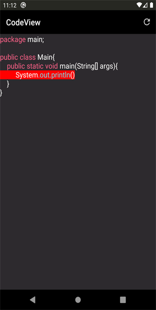

# CodeView
[](https://app.codacy.com/gh/AmrDeveloper/CodeView?utm_source=github.com&utm_medium=referral&utm_content=AmrDeveloper/CodeView&utm_campaign=Badge_Grade_Settings)
[]() 
[](https://jitpack.io/#AmrDeveloper/CodeView)

Android Library to make it easy to create your CodeEditor or IDE for any programming language 
even for your programming language, just config the view with your language keywords and other attributes
and you can change the CodeView theme in the runtime so it's made it easy to support any number of themes, 
and CodeView has AutoComplete and you can customize it with different keywords and tokenizers.

### Demo
<p align="center">
  
  
  
  
  
</p>

### Main Features:
- Can support any programming language you want
- Can support AutoComplete and customize it with different tokenizers and design
- Can support any theme you want and change it in the runtime
- Syntax Highlighter depend on your patterns so you can support any features like TODO comment
- Can support errors and warns with different colors and remove them in the runtime
- Can change highlighter update delay time

#### Who uses CodeView?
- [MathScript](https://play.google.com/store/apps/details?id=com.amrdeveloper.mathscript)

##### If you use CodeView in an interesting project, I would like to know!

#### Add CodeView to your project

##### Add it to your root build.gradle
````gradle
allprojects {
	repositories {
	   ...
	   maven { url 'https://jitpack.io' }
	}
}
````

##### Add the dependency
````gradle
dependencies { 
     implementation 'com.github.AmrDeveloper:CodeView:1.0.0'
}
````

#### Documentation:
CodeView is based on AppCompatMultiAutoCompleteTextView

Add CodeView on your xml 

```xml
<com.amrdeveloper.codeview.CodeView
    android:id="@+id/codeView"
    android:layout_width="match_parent"
    android:layout_height="match_parent"
    android:background="@color/darkGrey"
    android:dropDownWidth="@dimen/dimen150dp"
    android:dropDownHorizontalOffset="0dp"
    android:dropDownSelector="@color/darkGrey"
    android:gravity="top|start" />
```

Initalize CodeView

```java
CodeView codeView = findViewById(R.id.codeview);
```

Clear all patterns from CodeView

```java
codeView.resetSyntaxPatternList();
```

Add Patterns for your language, you can add any number of patterns

```java
codeView.addSyntaxPattern(pattern, Color);
```

Or add all patterns as an Map Object

```java
codeView.setSyntaxPatternsMap(syntaxPatterns);
```

Rehighlight the text depend on the new patterns
  
```java
codeView.reHighlightSyntax();
```

Add error line with dynamic color to support error, hint, warn...etc

```java
codeView.addErrorLine(lineNumber, color);
```

Clear all error lines

```java
codeView.removeAllErrorLines();
```

Rehighlight the erros depend on the error lines

```java
codeView.reHighlightErrors();
```
  
Add Custom AutoComplete Adapter

```java
//Your langauge keywords
String[] languageKeywords = .....
//List item custom layout 
int layoutId = .....
//TextView id on your custom layout to put suggestion on it
int viewId = .....
//Create ArrayAdapter object that contain all information
ArrayAdapter<String> adapter = new ArrayAdapter<>(context, layoutId, viewId, languageKeywords);
//Set the adapter on CodeView object
codeView.setAdapter(adapter);
```

Add Custom AutoComplete Tokenizer
    
```java
 codeView.setAutoCompleteTokenizer(tokenizer);
```

Set highlighter update delay

```java
codeView.setUpdateDelayTime();
```

#### For real examples on how to use CodeView check the example app
